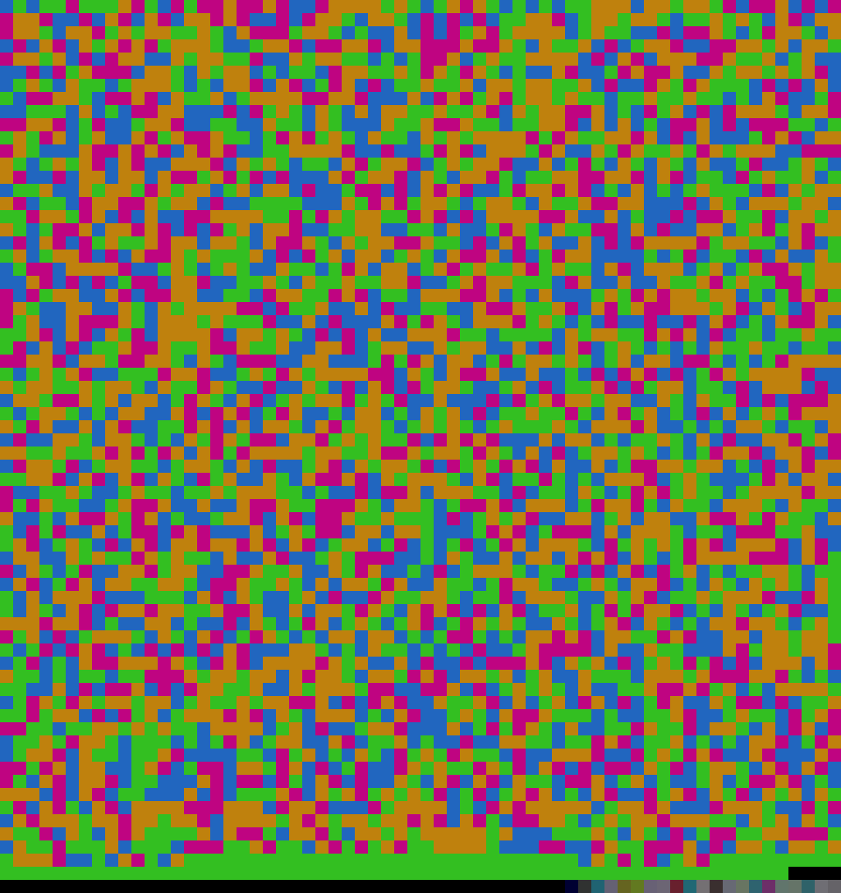

# BioNTech RNA image generator

Generate image containing full sequence of the BioNTech/Pfizer mRNA vaccine RNA
sequence published by WHO.

## Usage

Make sure to install the dependencies:
- ruby
- tr

Then:
1. Clone this repo
2. Run `make`
3. You will get `rna.png` containing your image

You can customise the colours by setting `A`, `U`, `G` and `C` variables to your
liking, in RGB hex encoding.

## License

[CC-BY-SA 4.0](https://creativecommons.org/licenses/by-sa/4.0/)
